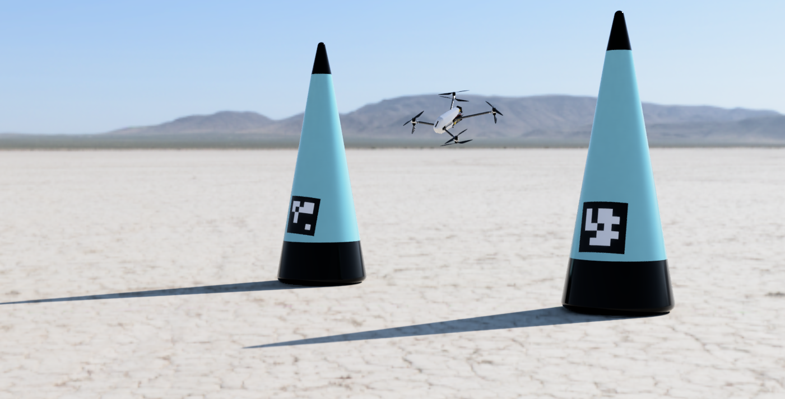
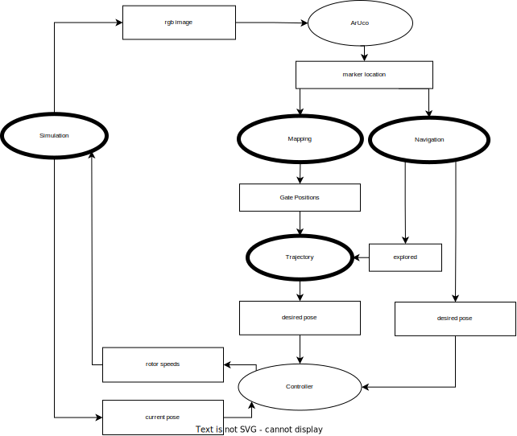

# Student-Airrace Simulation Platform

## Introduction 
This repository contains a simulation environment and a collection of algorithms to implement autonomous drone racing. For a detailed description please refer to the report or to the project presentation:
 - [Report](docs/Report.pdf)
 - [Presentation](docs/Presentation.pdf)

- [Student-Airrace Simulation Platform](#student-airrace-simulation-platform)
  - [Introduction](#introduction)
  - [Getting Started](#getting-started)
  - [Archtiecture Overview and Interfaces](#archtiecture-overview-and-interfaces)
  - [Package Documentation](#package-documentation)
  - [Responsibilities of members](#responsibilities-of-members)

## Getting Started
First clone this repositoriy with submodules:

    git clone --recurse-submodules git@github.com:TUM-AAS/autsys-projects-student-airrace.git
    cd autsys-projects-student-airrace

This project can be started with a single command:

    ./run.bash

Please make sure that the bash file is executable and docker is installed.
All parameters are optional. If you decide to launch a specific version of this project, you can find the syntax below.
~~~
Syntax: run.sh -d [StarOne|StarOne8|Default] -s [HITL|SITL] -t [3|4|6]  -b [True|False]
options:
-d     selects the drone that it used in the simulation. There are three options:
             1. StarOne  - The official StudentAirRace prototype, which is a octacopter in a coaxial configuration(with Quadcopter Dynamics) 
             2. StarOne8 - The official StudentAirRace prototype, which is a octacopter in a coaxial configuration(with octacopter dynamics)
             3. Default  - The standard Quadcopter of the Autonomous Systems chair at TUM
-s     selects the type of simulation. There are to options:
             1. HITL - Hardware in the Loop. This option reqiures the drone to be connected via ethernet.
                       The Simulations runs on this machine, while all other components will be deployed to the connected drone onboard computer.
             2. SITL - Software in th Loop. This option does not require any dependencies
                       The whole project runs on this machine.
-t     Selects the degree of freedom of the trajectory. There are three options:
             1. 3 - The trajectory is constrained by the position only. The drone is able to optimize the roll and pitch angle, but the yaw angle and the position is fixed at the gates.
             2. 4 - The trajectory is constrained by the position and the yaw angle. The drone is able to optimize the roll and pitch angle, but the position is fixed at the gates.
             3. 6 - The trajectory is constrained by the position, the yaw angle and the roll and pitch angle. The drone is able to optimize the roll and pitch angle, but the position is fixed at the gates.
-r     decides if the docker image should be rebuild instead of downloaded from dockerhub (This option is only necessary if the project needs to be executed on another arhitecture than x86
~~~
## Archtiecture Overview and Interfaces
This diagram shows an overview of the architecture and the required nodes.
<figure>
    

    
    

</figure>

## Package Documentation
  - [Simulation](./base_image/catkin_ws/src/simulation/README.md)
  - [Perception and Mapping](./catkin_ws/src/mapping/README.md)
  - [Navigation](./catkin_ws/src/navigation/README.md)
  - [Trajectory Generation](./catkin_ws/src/trajectory6/README.md)
  
## Responsibilities of members
  - Amin Seffo - Navigation
  - Francisco Fonseca - Trajectory Generation
  - Simon Pokorny - Simulation and Benchmark
  - Luca Dalle Sasse - Mapping and Vision

[def]: #student-airrace-simulation-platform