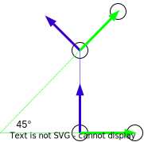

# Simulation

The Simulation is build with Unity and written in c#. 
The source code of the simulation is part of a [seperate repository](https://gitlab.lrz.de/00000000014A6894/student-airrace_unity-environment.git) to keep the repository size as small as possible. 
This Readme file gives a short introduction of the racetrack. Please refer to the [report](/docs/Report.pdf) to get further details. 

## Racetrack
The racetrack is composed of ten gates, each consisting of
two pylons. The pylons are equipped with ArUco markers at
the front and the back so that the orientation and position
of the pylon can uniquely identified. Figure 2 illustrates the
pylons’ dimensions and the position of the ArUco marker.
### The Pylon
The pylons are 12m high and at a height of 5.5m there are ArUco marker attached
|  |
|:--:|
| <b>Pylon Size - Fig.1 - Size of one pylon and the position of the ArUco Marker</b>|
### Orientation of the Gates
Each gate is aligned with the z-axis of the previous gate. The angle between the y-axis of two consecutive gates is always 45°.
Figure 2 
|  |
|:--:|
| <b>Gate Orientation - Fig.2 - Orientation of the gates in reaĺation to consecutive gates</b>|
### ArUco Marker
Each Pylon and its position is uniquly identifyable by two aruco marker.
One at the front and one at the back of the pylon. 
The aruco marker at the front has an even number and the aruco marker on the back has an odd number
The figure below shows a top view on the first gate with annotations about their ArUco Marker.
| |
|:--:|
| <b>Aruco Marker - Fig.3 - Distance and IDs of ArUco Marker</b>|

## Hardware in the Loop Simulatoin

This project supports hardware in the loop simulation. (run.bash -s HITL)

A requirement is, that an nvidia jetson board is connected to the computer that runs the simulation via ethernet. The ethernet network interface of the Simulation workstation needs to have a static ip and a default gateway assigned. 
IP 10.0.0.1
Default Gateway 10.0.0.2
Subnetmask: 24

The network interface of the companion computer must be configured accordingly: 
IP 10.0.0.2
Default Gateway 10.0.0.1
Subnetmask: 24

To make sure that no passwort promt is necessary, it is suggested to create an ssh key pair and install the public key  of the simulation workstation in the authorized keys file on the companion computer. 
The user that rans the simulation on the companion copmuter is called star. If your username differs, it can easily configured in the run.bash file. 

Because of the fact that the nvidia jetson nano has an ARM based CPU Architecture, the base image needs to be build seperately. To achieve that you can find docker files of the base image for ARM cpus in the base_image folder.