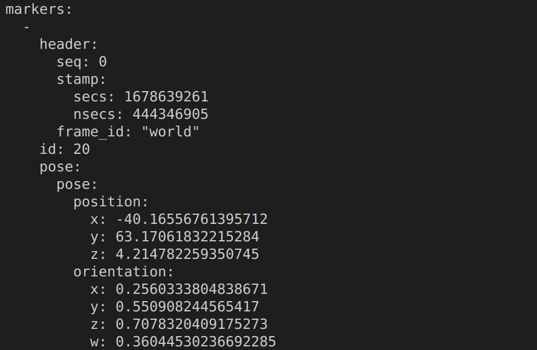
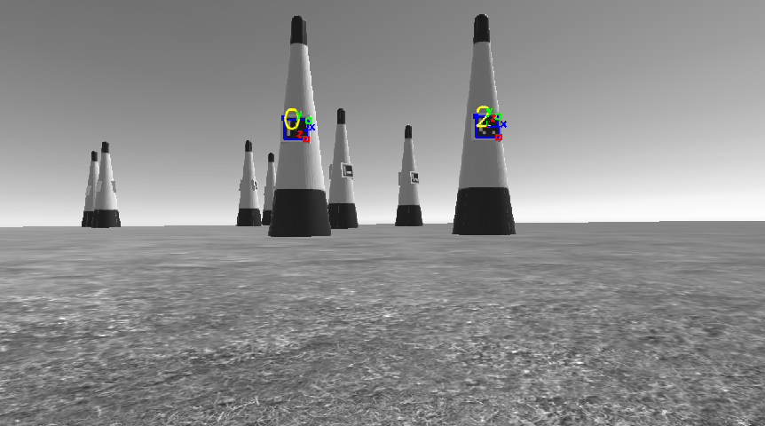
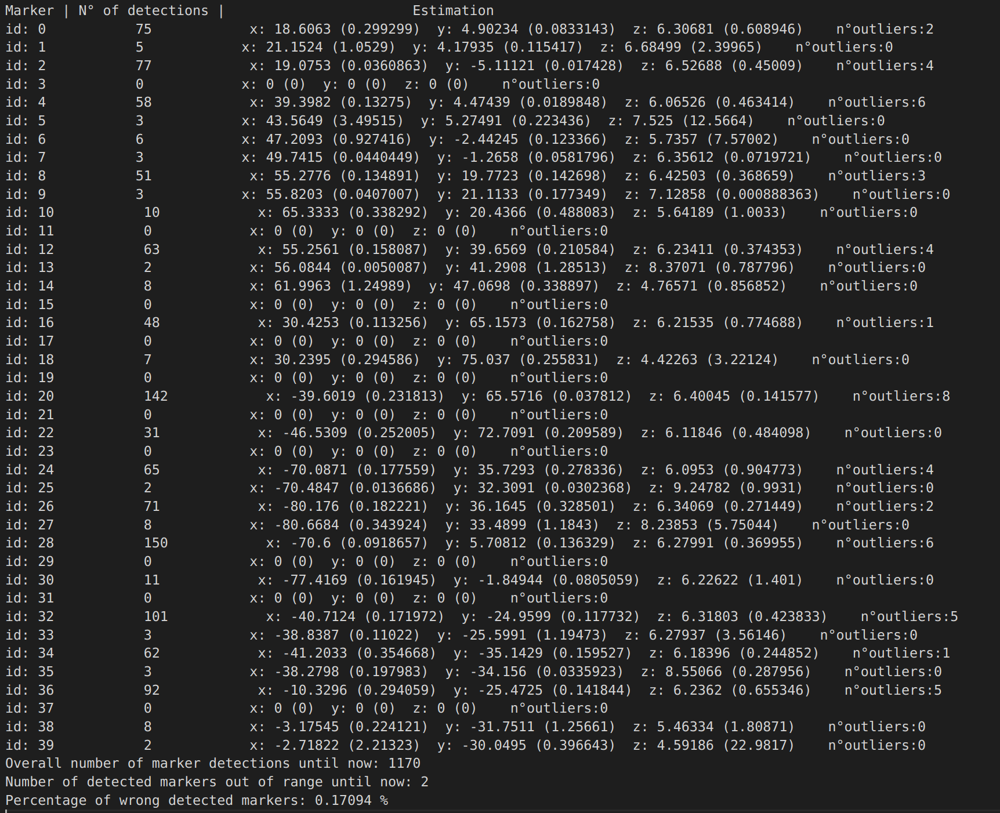

# Perception & Mapping

This module is responsible for launching the vision package (aruco marker detection) as well as the mapping part.

## Perception - Aruco Marker detection

Our drone has only one camera providing RGB undistorted images. It is publishing two different topics: **/stereo/left/image_raw** (which contains the image itself) and **/stereo/left/camera_info** (which provides camera's intrisincs and calibration parameters).

The vision part of the project is achieved by adopting the [aruco_ros][Aruco ROS] package. It allows to obtain messages containing the position and pose estimation of each detected marker of the form:

* aruco_ros/Marker.msg

        Header header
        uint32 id
        geometry_msgs/PoseWithCovariance pose
        float64 confidence

 * aruco_ros/MarkerArray.msg

        Header header
        aruco_ros/Marker[] markers

The resulting messages are published inside the topic **/aruco_marker_publisher/markers** and the structure of a message can be seen in the following figure:
        

<figure>
    
    <figcaption></figcaption>
</figure>


It is aslo possible to visualize separately the result of the estimation by run the following command:

```
rosrun image_view image_view image:=/aruco_marker_publisher/result
```

<figure>
    
    <figcaption></figcaption>
</figure>

## Map generation

During the whole simulation, the detected coordinates of each pylon are stored through a ROS service. These coordinates are then used to create an improved estimation of the whole racetrack by a simple mean of all the values for each x,y,z coordinate of each gate. To further improve the accuracy of the estimation, an outlier analysis has been introduced to not consider unreliable marker measurements that could substantially affect the overall estimation. This is just a first simple implementation but it could be further improved by using other techniques like Kalman Filters.

The overall picture of the estimation and improvement over time is stored in the following output [file][output_file].

<figure>
    
    <figcaption></figcaption>
</figure>


# Reference Links

- [Image pipeline - ROS][Image pipeline]
- [image_proc][image_proc]
- [Pose Estimation Aruco Marker ROS][Pose estimation]
- [Aruco ROS][Aruco ROS]

[Image pipeline]: http://wiki.ros.org/image_pipeline
[Pose estimation]: https://github.com/immersive-command-system/Pose-Estimation-Aruco-Marker-Ros
[Aruco ROS]: https://github.com/pal-robotics/aruco_ros
[image_proc]: https://wiki.ros.org/image_proc
[output_file]: ./map_generation/track

